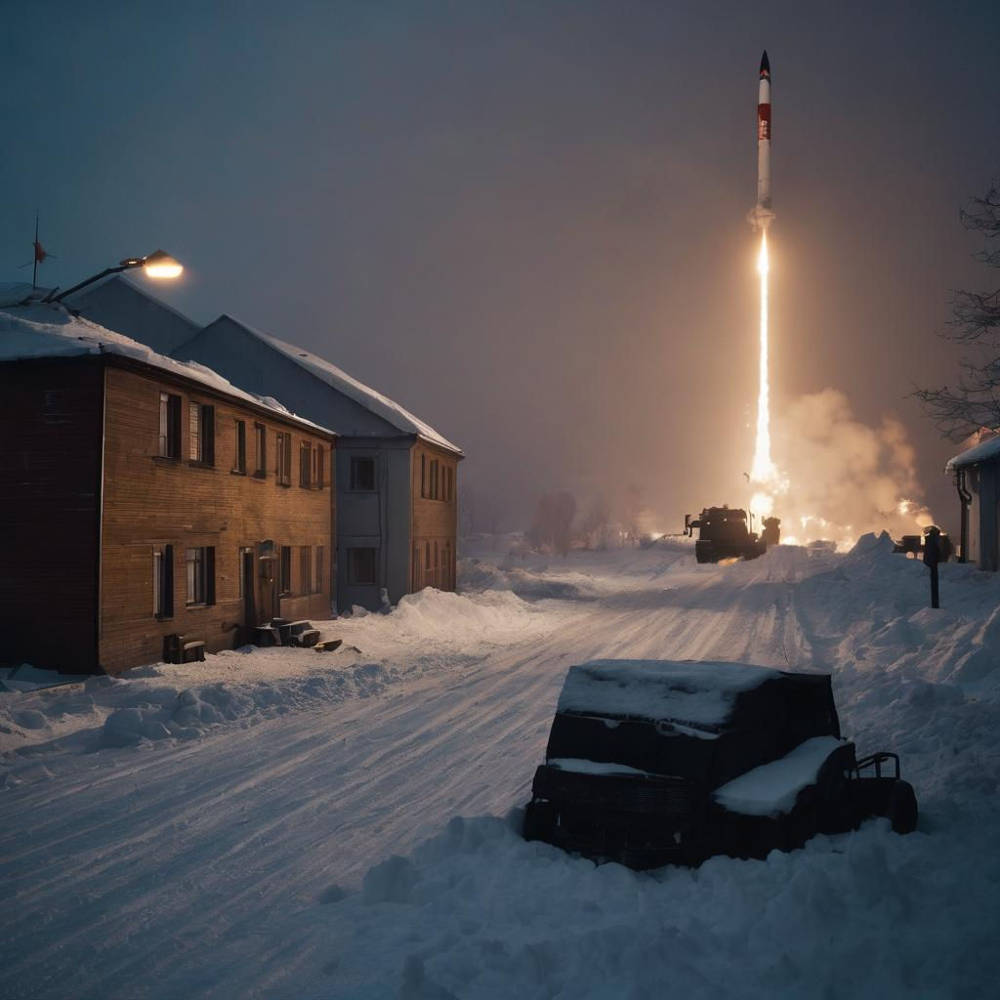

## Okay, lets go

### Question

How can I transform people experience about the propaganda - in Soviet Union and Nowdays in Social Media - in storytelling and create a informative visual experience? 

### Methods

I want to experiment with my interviews, which i have done during my thesis, to try to use them as a basement for narrative stories. And try different ways to visualize them 

### Test Day

In Test Day I want to test narratives in Twine and maybe visuals

### Needs

Ill use illustrations/Twine/Figma/not sure yet for the test day

### The next steps

Writing, drawing, experimenting. 

### Samples

Prompt - "imagine soviet union propagandist, 1987, winter, I was on rearmament, we were at the stage of combat alignment, I was the commander of a separate anti-aircraft-missile division. It's minus 35 outside, it's night. There is a preparation for night fighting."

Free Ai image generator

