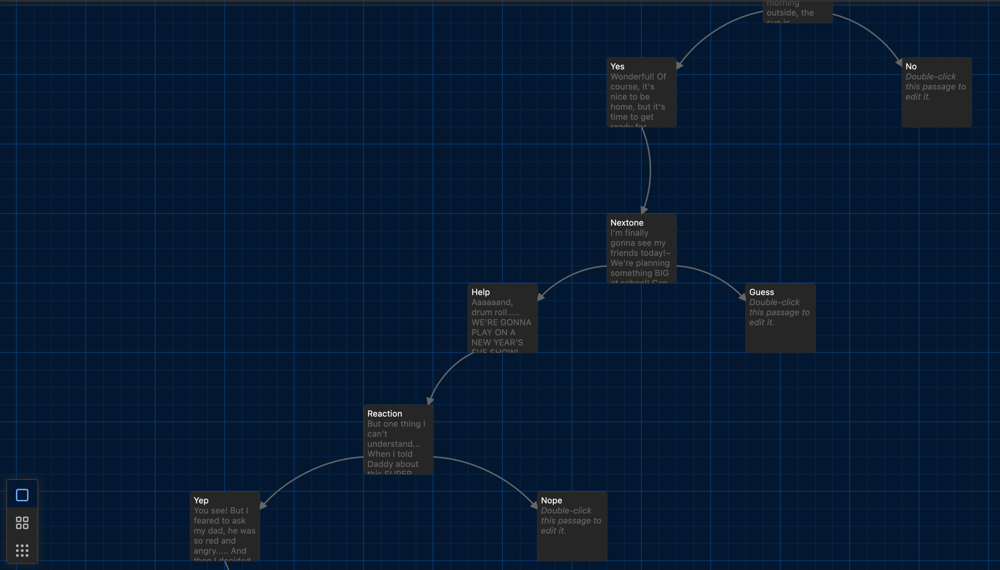
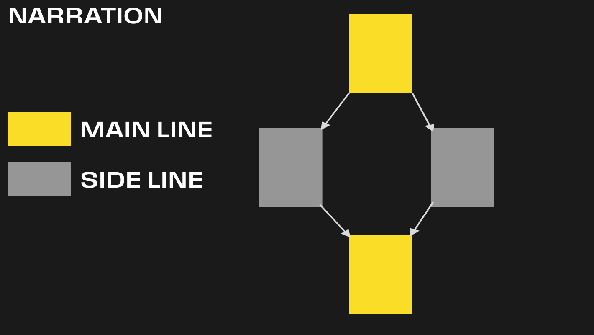

Hello, my name is Anastasia!

It's Monday morning outside, the sun is shiiiiining~ 

This day is sooo important!!!

Would you like to join me?  Pleeeeeease~

[[Yes, of course!|Yes]]    [[Sorry, I'm too busy|No]]

——————————————

Wonderful!

Of course, it's nice to be home, but it's time to get ready for school!

Soooo, big pencil case, cute notebook, sweet candy, boring textbook.....

I need something else...

But it's not important!

[[Really?|Nextone]]

——————————————

I'm finally gonna see my friends today!~

We're planning something BIG at school!

Can you guess or maybe help?

[[Could you help me pleeease?|Help]]     [[Let me think!|Guess]]

——————————————-

Aaaaaand, drum roll..... WE'RE GONNA PLAY ON A NEW YEAR'S EVE SHOW! 

YAAAAAAY! 

We're gonna be the bravest of the Pioneers and Komsomol!

And we will PUF PUF the evil that's trying to steal the New Year! 

[[Woooow|Reaction]]

———————————————

But one thing I can't understand... When I told Daddy about this SUPER PUPER EVENT last week, he said like:

"Pioneers and Komsomol, damn it, they are part of 'Communist Mafia'". 

Huuuuh, what's the mafia is?~ Do you know?

[[Yes, of course I know!|Yep]]    [[I have nooo idea|Nope]]

————————————————-

You see! 

But I feared to ask my dad, he was so red and angry.....

And then I decided to ask my teacher in school, 'Why are the Komsomol and Pioneers like a mafia?' And guess what? 

My teacher got really mad! She said, 'Don't ever say that again!' and even called my parents to school. Dad was super angry at me, but I don't get it, why?

And the teacher told me that I wouldn’t be able to come to school for a WEEK!!!

[[I cant believe it | Next]]

—————————————————-

Yes, I couldn't believe too! 

But YAY finally I'm coming back! 

I'm gonna be in the show cause Daddy told the teacher he likes our country lots and he gave her a BIIIG, BIIIG bottle of Dom Perin! 

The teacher was not angry anymore!

—————————————————-

### HOOK CHOICE

—————————————————

Ohhhh I'm finally in school! 

Let's go, I'll show you the class!

[[Let's go]]

——————————————

That's my desk right there! 

They are all the same, but I drew a flower on mine so I could always always find it~

Do you like it? Say yes!

[[Yes of course!|Like]]      [[I'm not sure, but lets say yes|Dislike]]

——————————————

Oh, oh, class is starting, what are we going to draw today?

Flower!? Bunny!? Maybe ducky!?

[[Maybe Bunny?|PaintStart]]

——————————————

Oh holy bunnies, we're gonna paint New York!

But why?

[[ I dont know too]]

——————————————

I do not understand too.

But there’s nothing to do, let’s draw!

I heard about New York! Dad listens to the radio at night, and there were something!

Now I’ll draw it and show you, don’t peek!!!

[[Goood, good]] [[Secretly peek]]

——————————————

Guess my drawing!

[[1]] [[2]] [[3]]

——————————————

Yeeess! 

On Radio people told that in New-York they have biiiiiiiiiiig builduing, so so big, and they builduing more and more!  So I draw lots of them~

But also they told something else...

[[What?]]

——————————————

They told, that people there dont like us! And that they want to fight us with biiig biiiiiig nuclear firecrackers… And that they build them i their cities!

So I draw this nuclear firecrackers between buildings….

And also they told that if our great great country and them gonna start poof poof to each other, there will be nothing left, only nuclear dust!

Im not afraid but...

[[But?]]

——————————————

I hope there won't be a big nuclear boom..... 

I asked grandmom about that, after i heard this from the radio..

And she told, that our country is the biggest and the greatest in the world! So no-one gonna be brave enouph to attack us! Soviet and Party gonna be here always!

—————————————————-

### HOOK CHOICE

—————————————————