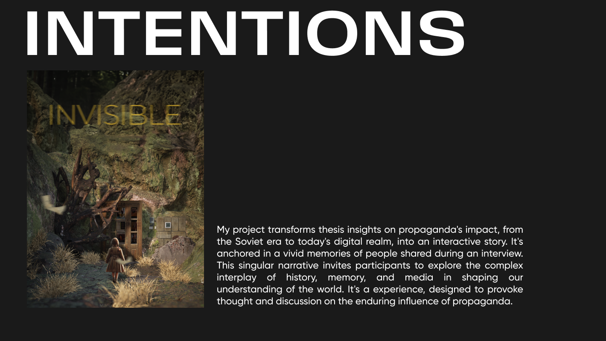

In exploring a selection of games including "Dear Esther: Landmark Edition" by The Chinese Room & Robert Briscoe, "What Remains of Edith Finch" and "The Unfinished Swan" by Giant Sparrow, "Dr. Langeskov, The Tiger, and The Terribly Cursed Emerald: A Whirlwind Heist" by Crows Crows Crows, "Virginia" by Variable State, "Scanner Sombre" by Introversion Software, and "Everybody's Gone to the Rapture" by The Chinese Room, has provided a deep dive into the realm of narrative-driven games. These titles underscore the profound potential of video games as a medium for immersive storytelling.

I learned the power of innovative storytelling and unique gameplay to create deeply engaging and memorable experiences. The use of environmental storytelling, varied storytelling techniques and inventive mechanics can greatly enhance immersion and make each game a unique journey. The emotional impact of well-crafted stories, combined with artistic visual and aural elements, underscores the potential of video games as a compelling medium for narrative exploration.

I learned the importance of balancing innovation with accessibility and clarity in game design. While unique gameplay and storytelling approaches can set a game apart, they must be intuitive and satisfying for a broad audience. Ensuring a coherent narrative and providing enough content and interactivity are crucial to avoid leaving players feeling confused or dissatisfied. These challenges highlight the need for thoughtful design that takes into account player expectations and the diversity of the gaming community.

To create the visual and emotional tone that will define the game design, I have explored different ways of visualizing the content in 3d space that contains both realistic concepts and unique approaches.  Because I want to create a visual that can fully convey the feeling of propaganda and its consequences

I'm working on the narrative part: which interviews would be the most appropriate to showcase, which moments I can take, how I can connect them together

At this point I don't have a definite answer about possible interactions, but I'm exploring possible solutions that have been used in other projects. The closest to my project at the moment are

Alpha Protocol, despite its flawed combat and complex story, excels in its conversation mechanics and decision-making system. They are interesting due to their dynamic and time-sensitive nature, which requires players to make quick decisions during conversations. This interaction mirrors real-life quick thinking and smooth talking essential for a spy, adding to the game's immersion and realism. The choices made in these dialogues can significantly influence the game's storyline, character relationships, and outcomes, making each conversation a critical and engaging part of the gameplay.

"Subnautica" is an underwater adventure game set on an alien ocean planet, where interaction with the environment is crucial for survival.

At this point I don't have a definite answer about possible interactions, but solutions I can make:
- interaction with the environment (objects that are related to the narrative line);
- certain moments in the story where you have to make a choice
- interaction with the character's voice (?)

At this stage I am still in contemplation of what software will help me realise the artistic direction, and what in turn will stand up to my computer

